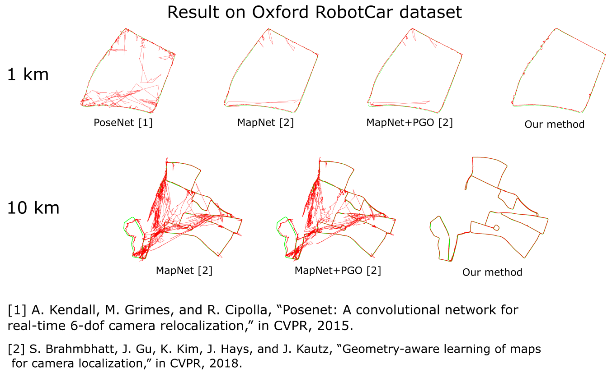

About
============
MATLAB code of our DICTA 2019 paper:

"Visual Localization Under Appearance Change: A Filtering Approach" - DICTA 2019 **(Best paper award)**. [Anh-Dzung Doan](https://sites.google.com/view/dzungdoan/home), [Yasir Latif](http://ylatif.github.io/), [Thanh-Toan Do](https://sites.google.com/view/thanhtoando/home), [Yu Liu](https://sites.google.com/site/yuliuunilau/home), [Shin-Fang Ch’ng](https://sites.google.com/view/shinfang-chng/), [Tat-Jun Chin](https://cs.adelaide.edu.au/~tjchin/doku.php), and [Ian Reid](https://cs.adelaide.edu.au/~ianr/). [[pdf]](https://arxiv.org/abs/1811.08063)

If you use/adapt our code, please kindly cite our paper.

<b>Comparison results on Oxford RobotCar dataset [3] between PoseNet [1], MapNet [2], and our method</b> 

[1] Alex Kendall, Matthew Grimes, and Roberto Cipolla, "PoseNet: A Convolutional Network for Real-Time 6-DOF Camera Relocalization", in CVPR 2015.

[2] Samarth Brahmbhatt, Jinwei Gu, Kihwan Kim, James Hays, and Jan Kautz, "Geometry-Aware Learning of Maps for Camera Localization", in CVPR 2018.

[3] Will Maddern, Geoffrey Pascoe, Chris Linegar, and Paul Newman, "1 Year, 1000km: The Oxford RobotCar Dataset", The International Journal of Robotics Research (IJRR), 2016.

Dependencies
============

+ VLFeat library, version 0.9.21 (http://www.vlfeat.org/)
+ yael library (http://yael.gforge.inria.fr/)
+ Piotr's Computer Vision Matlab Toolbox (https://pdollar.github.io/toolbox/)
+ Some codes adapted from Akihiko Torii and Relja Arandjelovic (http://www.ok.ctrl.titech.ac.jp/~torii/project/247/)

We included, compiled and tested all 3rd-party libraries on MATLAB R2018a, Ubuntu 16.04 LTS 64 bit

Dataset
============

+ For precomputed features, please download work_dir.zip from [here](https://universityofadelaide.box.com/s/oiyp79si64713qrmt8tsytdwi7zdhxyk)
and unzip it to the source code's directory.

+ If you want to extract features from original images, please download original images from [here](https://universityofadelaide.box.com/s/5ns92t1lfn49v2xppkjk12sk1e6oue7w).
	- Unzip `2014-06-26-08-53-56.zip`, `2014-06-26-09-24-58.zip`, and `2014-06-23-15-41-25.zip` to `dataset/alternate/`
	- Unzip `2014-11-28-12-07-13.zip`, `2014-12-02-15-30-08.zip`, and `2014-12-09-13-21-02.zip` to `dataset/full/`

+ Projection and whitening matrices are adapted from DenseVLAD paper of Torii et al. (http://www.ok.ctrl.titech.ac.jp/~torii/project/247/)

Currently, we only publish the code to test Oxford RobotCar dataset with alternate (1km) and full (10km) routes.
We will publish code for GTA dataset soon

Feature Extraction
============

Run `extractFeatures.m` to extract features. 

Note that please change the `route` variable to `alternate` (1km) or `full` (10km)

Localization
============

Run `doMCVL.m` to perform visual localization with MCVL, and `doHMM.m` to perform visual localization with HMM.
Note that please change the `route` variable to `alternate` (1km) or `full` (10km)

After finishing, it will show mean/median errors, and plot the predicted trajectory same as Figure 8d and 8g within the paper

Support
============

If you have any questions, feel free to contact me
